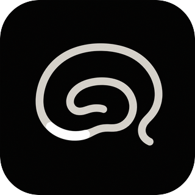

# CA3 Codex Plugin



CA3 gives AI agents a private, user-owned memory layer so important context can follow you across ChatGPT, Codex, Claude Code, and browser workflows.

This repository is a Codex plugin marketplace source for connecting Codex to the public CA3 OAuth MCP endpoint.

## Install

Add this marketplace source:

```bash
codex plugin marketplace add enactflow/ca3-codex-plugin
```

Then install `CA3` from the Codex plugin directory.

On first use, Codex should open the CA3 OAuth flow and ask you to authorize the requested scopes.

## MCP Endpoint

```text
https://ca3.dribwise.ai/mcp
```

## Plugin Layout

```text
.agents/plugins/marketplace.json
plugins/ca3/.codex-plugin/plugin.json
plugins/ca3/.mcp.json
plugins/ca3/skills/ca3/SKILL.md
```

## Usage

Use CA3 explicitly:

```text
@CA3 remember this project decision.
```

Or let Codex use CA3 automatically when project instructions say CA3 is the shared context surface.

CA3 behavior is defined by the live MCP tool descriptions exposed by:

```text
https://ca3.dribwise.ai/mcp
```

The plugin skill is only a bootstrap hint. It intentionally does not duplicate the detailed notes and attachments rules, so all CA3 clients share the same behavior contract from the MCP server.

When creating or updating a note through MCP, include the required `profile_hint` argument. This should describe the durable user intent or profile signal behind the note, not just the immediate action.

## Troubleshooting

After installing, updating, or re-authenticating the plugin, start a new Codex thread before testing CA3. Existing threads may keep a stale plugin skill or OAuth connection snapshot.

If an old thread reports:

```text
oauth_refresh_token_missing
TRIGGER_REAUTHENTICATION
```

authenticate CA3 again, confirm `codex mcp list` shows `ca3` as enabled with OAuth, then open a new Codex thread.

If an old thread reports that it cannot find `SKILL.md` or that plugin skill paths do not match, treat it as stale Codex plugin cache state. The CA3 MCP tools may still work through tool discovery, but the stable fix is to open a new thread after installation or update.

## License

MIT
